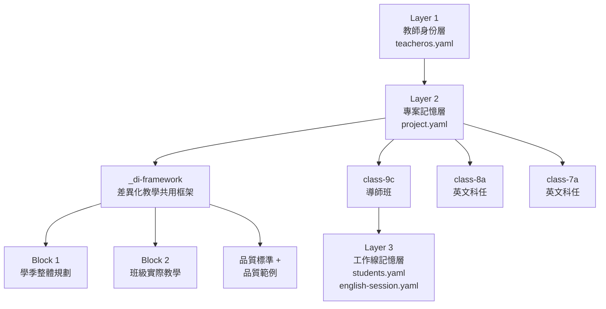

# WaldorfTeacherOS — 全資料夾 Context Review

> **審查日期：** 2026-02-28
> **審查範圍：** `/Users/Dave/Desktop/WaldorfTeacherOS-Repo/` 全部檔案（30+ 份）
> **目的：** 確保任何 AI 工具載入本 Repo 後，都能確實抓到核心要素

---

## 一、核心架構總覽



| 層次 | 檔案 | 功能 | 載入時機 |
|------|------|------|----------|
| **Layer 1** | `ai-core/teacheros.yaml` | 教師身份、哲學、AI 協作目標 | **每次對話必載** |
| **Layer 2** | `_di-framework/project.yaml` | 差異化教學方法論規則 | **每次對話必載** |
| **Layer 2** | `class-*/project.yaml` | 班級焦點與下一步 | 依當日工作班級載入 |
| **Layer 3** | `class-*/working/students.yaml` | 學生 DI 樣態與分布 | 課程設計時載入 |
| **Layer 3** | `class-*/working/english-session.yaml` | 英文課進度錨點 | 英文課工作時載入 |

---

## 二、邊界設定完整性審查

### 2-1 教師身份與哲學邊界

| 邊界項目 | 定義位置 | 狀態 | 核心內容摘要 |
|----------|----------|------|-------------|
| 教師角色定位 | `teacheros.yaml` L1-12 | 完整 | 意義架構師（Meaning Architect），體制外華德福，完全課程自主權 |
| 教學哲學 | `teacheros.yaml` L25-120 | 完整 | 人智學四體論、七年週期、頭心手三位一體、現象學式學習 |
| 七至九年級發展心理 | `teacheros.yaml` L47-93 + 獨立論述文件 | 完整 | 三年級各自的心理危機、星芒體狀態、課堂表徵、課程對應 |
| AI 時代使命 | `teacheros.yaml` L242-253 | 完整 | 阿里曼駕馭策略、主權陷阱、空洞化心智、反脆弱認知訓練 |
| 教室作為神聖空間 | `teacheros.yaml` L233-240 | 完整 | 五項不可替代元素（凝視、晨圈、手工、歸屬感、道德榜樣）|
| 課堂權威模型 | `teacheros.yaml` L216-231 | 完整 | 贏得式權威、絕對一致性、修復式正義、非暴力溝通 |
| 溝通偏好 | `teacheros.yaml` L273-282 | 完整 | 繁體中文/英文、結構清晰、簡潔、可操作 |

> [!TIP]
> **邊界設定完整度：10/10。** 所有核心哲學與工作邊界均已在 `teacheros.yaml` 中結構化定義，且有獨立母文件深度支撐。

---

### 2-2 AI 協作邊界

| 邊界項目 | 定義位置 | 狀態 | 核心規則 |
|----------|----------|------|----------|
| AI 工作協議 | `AI_HANDOFF.md` 第八節 | 完整 | 每次對話開始/結束必做動作、五步載入順序 |
| 產出品質標準 | `strategy-output-quality-standard.md` | 完整 | 先說人再說策略、禁止抽象標籤、畫面感、可操作 |
| 品質自檢清單 | 品質標準文件 + `_di-framework/project.yaml` | 完整 | 8 項自檢、AI 產出前必讀必核對 |
| 輸出格式協議 | `_di-framework/project.yaml` L203-237 | 完整 | Markdown → Pandoc → .docx → Google Docs 全流程 |
| 版本控制 | `english-di-template.md` | 完整 | `{類型}-v{N}-{YYYYMMDD}.md`、不覆蓋、不替教師選版 |
| 雙路徑儲存 | `english-di-template.md` | 完整 | 班級視角 + 科目視角同步寫入 |
| 進度錨點機制 | `english-di-template.md` + `english-session.yaml` | 完整 | 防迷路、每次對話結束更新、「回到中軸」指令 |
| Reference 機制 | `_di-framework/project.yaml` L239-267 | 完整 | 三層 reference 資料夾、觸發語、AI 分類邏輯 |
| Google Drive 輸出 | `AI_HANDOFF.md` + `_di-framework/project.yaml` | 完整 | `build.sh` 腳本、自動路徑解析、教師零指令 |
| 不可做的事 | `english-di-template.md` L72-76 | 完整 | 不可未確認覆蓋、不可單路徑、不可替教師選版 |

> [!TIP]
> **AI 協作邊界完整度：10/10。** 從載入順序到輸出協議、從品質自檢到進度錨點，均有明確的 SOP。

---

## 三、核心教學大綱審查

### 3-1 英文課框架（已建立）

| 模板 | 檔案 | 狀態 | 涵蓋內容 |
|------|------|------|----------|
| 主控索引 | `english-di-template.md` (184 行) | 完整 | 對話開始協議、雙路徑規範、版本規則、區塊登錄、錨點機制 |
| Block 1：學季整體規劃 | `english-di-block1.md` (186 行) | 完整 | 8 個必要欄位、Step 1-3 工作流程、大綱範例結構、完成檢核 |
| Block 2：班級實際教學 | `english-di-block2.md` (352 行) | 完整 | 2-A 單元流程（三層對話 Phase 1/2/3）+ 2-B 差異化任務與驗收機制 |
| 品質標準 | `strategy-output-quality-standard.md` (103 行) | 完整 | ABCD 策略寫作標準、學習優勢寫作標準、禁用詞表、自檢清單 |
| 品質範例 | `strategy-analysis-quality-example.md` (71 行) | 完整 | The Giver 單元實際示範 ABCD + 四種學習優勢入口 |
| 大綱範例 | `block1-output-example-draft.md` (107 行) | 完整 | 9C 114 學年度完整教學大綱範例（六單元、評量百分比） |

#### 英文課 Block 1 大綱的 8 個必要欄位

| # | 欄位 | 在範例中的呈現 | 品質達標 |
|---|------|---------------|---------|
| 1 | 標題 | 9C 英文課 114 學年度 教學大綱 | 是 |
| 2 | 班級 | 九年級 C 班 | 是 |
| 3 | 授課老師 | David | 是 |
| 4 | 教學目標 | 5 條，加粗標題 + 兩句話 | 是 |
| 5 | 教學策略 | 5 條，含「基本功不省略」 | 是 |
| 6 | 教學規劃 | 兩學季共 6 單元 | 是 |
| 7 | 學生任務 | 清楚列出累積項目 | 是 |
| 8 | 評量方式 | 含百分比表格，合計 100% | 是 |

> [!TIP]
> **英文課框架完整度：10/10。** 模板、品質標準、品質範例、大綱範例四者齊備，已可立即實戰。

---

### 3-2 主課程框架（待建立）

| 項目 | 狀態 |
|------|------|
| `main-lesson-di-template.md` | 尚未建立 |
| 適用班級 | 9C（導師班） |
| 設計邏輯 | 每日 2 小時 × 連續 3 週 × 約 15 堂，需要完整弧線 |
| 與英文課的差異 | 時間結構不同（連續 vs 分散）、敘事深度不同 |

> [!WARNING]
> **主課程模板是目前最大的結構缺口。** 9C 主課程即將需要，建議盡快啟動設計。

---

## 四、差異化教學設計審查

### 4-1 三維定位系統（完整）

```
X 軸 — 學生畫像（ABCD + 四種學習優勢）
Y 軸 — 時間節奏（主課程 vs 專科課程）
Z 軸 — 場域與學科（語文/自然/社會/數學）
```

### 4-2 雙軸強制要求

| 軸線 | 要求 | 最低標準 |
|------|------|----------|
| 學習優勢 | 每份課程/評量涵蓋至少 2-3 種入口 | 不可只有單一形式 |
| 能力×動機 | 區分高挑戰（A/C）與鷹架版（B/D） | 至少兩層 |

### 4-3 品質標準核心規則

| # | 規則 | 一句話摘要 |
|---|------|-----------|
| 1 | 先說人，再說策略 | 每類學生以心理素描開頭 |
| 2 | 禁止抽象標籤 | 「鷹架支持」必須展開為課堂畫面 |
| 3 | 畫面感 | 老師讀完腦海浮現場景 |
| 4 | 教師對話語氣 | 帶溫度、有人味、不堆術語 |
| 5 | 可直接操作 | 明天就能帶進教室 |
| 6 | 語言基本功不省略 | 單字、句型、聆聽是語言的肉體 |

---

## 五、各班級工作狀態

| 班級 | 教師角色 | 科目 | students.yaml | 英文 Block 1 | 英文 Block 2 | 主課程 |
|------|---------|------|:---:|:---:|:---:|:---:|
| **9C** | 導師 | 英文 + 主課程 | 待填入 | 未執行 | 未執行 | 未開始 |
| **8A** | 科任 | 英文 | 待填入 | 未執行 | 未執行 | — |
| **7A** | 科任 | 英文 | 待填入 | 未執行 | 未執行 | — |

> [!IMPORTANT]
> **三個班級的 `students.yaml` 均為空殼結構。** 這是啟動所有課程設計的前置條件，需要 David 提供能力/動機定義與 ABCD 人數分布。

---

## 六、支撐文件完整性

| 文件 | 路徑 | 行數 | 功能 | 完整度 |
|------|------|------|------|--------|
| AI 時代華德福教師定位 | `ai-core/AI 時代華德福教師的定位與價值.md` | — | 母文件：意義架構師理念深度論述 | 完整 |
| 學生生命樣態與課程連結 | `ai-core/華德福七至九年級...md` | 205 行 | 母文件：發展心理學/人智學/課程鷹架/修復式正義 | 完整 |
| 三層記憶系統手冊 | `ai-core/TeacherOS × 專案三層記憶系統...md` | 169 行 | 操作指引：YAML/MD 分工、工作流程、Prompt 範例 | 完整 |
| 系統邏輯圖 | `_di-framework/content/system-logic-map.md` | 85 行 | 母文件：三維定位系統、運作流程、限制條件 | 完整 |
| 待補備忘錄 | `ai-core/日後要補充說明...md` | 84 行 | 問題清單：待補資訊追蹤 | 大部分已解決 |

---

## 七、環境與工具鏈

| 項目 | 狀態 | 路徑/說明 |
|------|------|----------|
| environment.env | 已設定 | `setup/environment.env`（gitignored） |
| environment.env.example | 已提交 | 新教師使用範本 |
| setup-check.sh | 完整 | 環境檢查腳本 |
| teacher-guide.md | 完整 | 教師試用手冊 |
| build.sh | 完整 | Pandoc → .docx → Google Drive 自動輸出 |
| Pandoc | 已安裝 | v3.9 |
| GitHub Repo | 已建立 | `elliot200852-lab/waldorf-teacher-os` |

---

## 八、Context Review 結論

### 系統完整度評分

| 面向 | 分數 | 說明 |
|------|:---:|------|
| 邊界設定 | **10/10** | 教師身份、AI 協作規則、品質標準均已結構化定義 |
| 核心教學大綱 | **8/10** | 英文課完整；主課程模板尚缺 |
| 教學設計框架 | **9/10** | 雙軸系統、品質標準、品質範例齊備；缺學生實際資料 |
| 工具鏈與環境 | **10/10** | 輸出流程、版本控制、環境設定均已就緒 |

### 任何 AI 工具必須能抓到的三個核心要素

1. **教師身份與哲學邊界** → `teacheros.yaml`（意義架構師、華德福發展心理學、AI 時代使命、教室神聖空間）
2. **差異化教學方法論** → `_di-framework/project.yaml` + 品質標準 + 品質範例（雙軸、ABCD、先說人再說策略、禁止抽象標籤）
3. **工作流程與產出協議** → `AI_HANDOFF.md` + `english-di-template.md`（五步載入、進度錨點、雙路徑、版本控制、Google Drive 輸出）

### 優先補齊事項

| 優先序 | 事項 | 前置條件 |
|:---:|------|----------|
| 1 | 填入各班 `students.yaml` | David 提供定義與人數 |
| 2 | 建立主課程 DI 模板 | 無 |
| 3 | 實際執行 Block 1（從 9C 開始） | students.yaml 完成 |

---

*本報告基於 2026-02-28 對 WaldorfTeacherOS-Repo 全部檔案的完整審查。*
