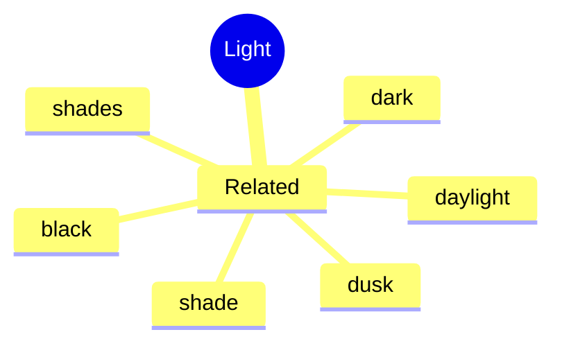

---
aliases:
  - "光與暗 語意場"
---
# Semantic Map

```mermaid
mindmap
  root((Light))
    Related
      shade
      dark
      dusk
      shades
      black
      daylight
```

> Render in any Mermaid-compatible editor (Obsidian, GitHub, etc.)